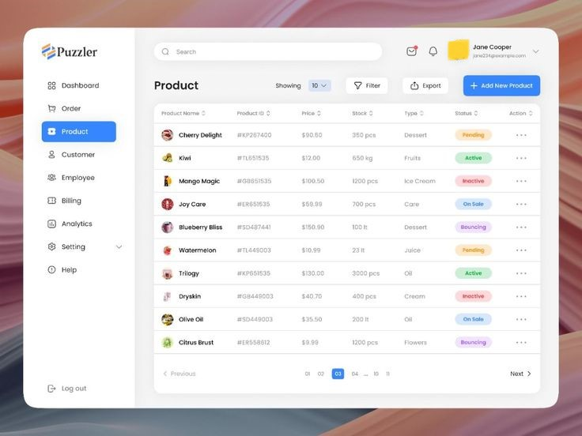
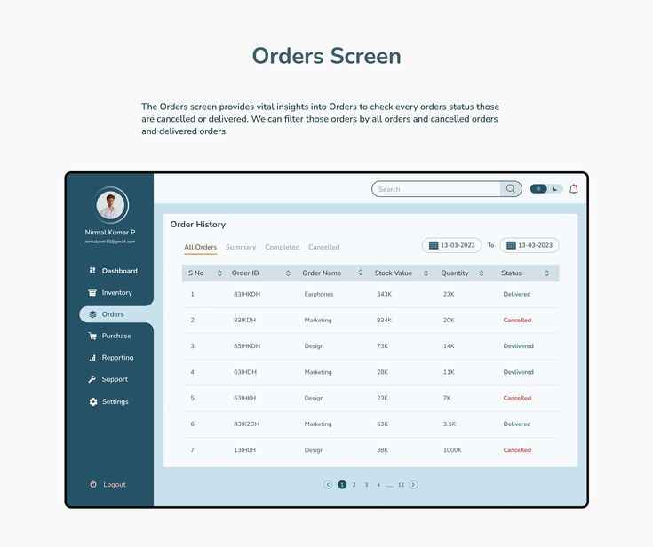

# Design

État: En cours
Assignation: Hasnae Lahkim

## 1. Design Style

### Design Direction

Modern + Professional + Clean + Youth Leadership Identity

### Visual Feeling

- Trustworthy
- Inspiring
- Elegant
- Institutional but modern
- Startup + Association style

### UI Style

- Minimal and spacious
- Strong hero sections
- Clear typography
- Large CTA buttons
- Premium dashboard feel

---

## 2. Brand Colors (optional)

### Primary Color

Deep Blue → Leadership + Trust

```
#1E3A8A
```

### Secondary Color

Golden Yellow → Energy + Opportunity

```
#F59E0B
```

### Accent Color

Emerald Green → Growth + Development

```
#10B981
```

### Neutral Colors

```
White → #FFFFFF
Light Gray → #F8FAFC
Dark Gray → #1F2937
Text Gray → #6B7280
```

### Optional Background Gradient

```
Blue → Purple soft gradient
```

---

## 3. Typography

### Recommended Fonts

### French / English

- Poppins
- Inter
- Montserrat

### Arabic

- Cairo
- Tajawal
- IBM Plex Sans Arabic

### Style

- Bold section titles
- Clean readable body text
- Professional dashboard typography

---

## 4. Public Website Pages (Visitor Side)

---

## Page 1 — Home

### Sections

- Hero Section
- Short definition of L.A.D.S
- Vision / Mission
- Core Values
- Last Events
- Latest News
- Team Preview
- CTA Join Us
- Footer

COmposants

- Nav bar (header)
- Footer
- Mission vision
- Values
- Events card
- Activities card
- News card
- Team card
- Big cta

### Important

This page must feel powerful and premium.

---

## Page 2 — About Us

### Sections

- Story of Association
- Vision
- Mission
- Strategic Objectives
- Core Values
- Departments Overview
- Team Members
- Why L.A.D.S

Composants:

- Strategie
- Departement

---

## Page 3 — Events

### Sections

- Upcoming Events
- Past Events
- All Events
- Event Details Card
- Register Button

### Tabs

- Coming
- Passed
- All

Composant :

- Tabulation( coming, passed,all)
- Register modal form

---

## Page 4 — Activities

### Sections

- Upcoming Activities
- Past Activities
- All Activities
- Activitie Details Card

### Tabs

- Coming
- Passed
- All

---

## Page 5 — News

### Sections

- News Cards
- Full Article View
- Latest Updates

Composants:

- Full article/new details

---

## Page 6 — Membership

### Sections

- Why Join Us
- Benefits
- Membership Form

### Form Fields

- Full Name
- Email
- Phone
- City

Composants:

- Benefits
- Form

---

## Page 7 — Contact

### Sections

- Contact Information
- Address
- Social Media Links
- Contact Form

---

## Page 8 — Login

### Sections

- Professional Login Form

---

---

# 5. Admin CMS  (content management system)

---

## CMS Modules

### Manage

- Events
- Activities
- News
- LADS Information
- Membership Requests
- Contact Messages
- Team Members

COmposants:

- Table
- Side bar nav
- Top header (name,notification btn…)
- Msg contact cards/table

ex:





---

# 6. Important UX Notes

### Must Have

- Clear CTA buttons
- Fast navigation
- Premium dashboard feel
- Clean spacing
- No visual overload
- Strong section hierarchy

### Avoid

- Too many colors
- Heavy animations
- Complex layouts
- Old-fashioned association style

---

---

# 7. Final Goal

The final design should look like:

> A professional startup + NGO + leadership institution platform
> 

NOT like:

- old association website
- school project
- basic admin panel

It must feel:

### Premium + Professional + Modern + Inspiring